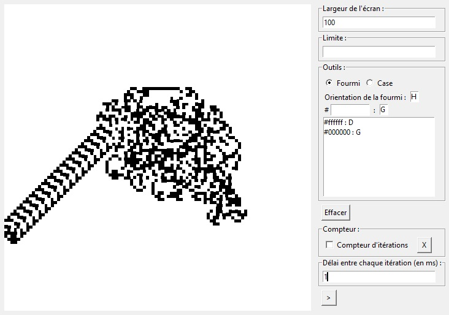
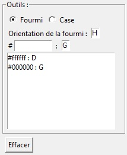

# Python-Langton-Ant

This is a reproduction of the Christopher Langton ant algorithme with some additional features.
## Features
- Possibility to add multiple ants
- Possibility to set the cells sequence
- Possibility to set cells
## Installation
1. Download the repository by clicking on `Code > Download ZIP`
2. Extract the ZIP file
3. Run `main.pyw`
## Requirements
- Python 3.7
- Python tkinter library
## Usage
You can define a sequence using this section :

To add a sequence part you have to type a hexadécimal color and select the direction in which the ant will rotate when she were on this type of cell (`G` for `LEFT` and `D` for `RIGHT`).

When an ant is on a cell, she turns in the direction specified in the sequence, then she turns the cell into the next of the sequence and finally she moves forward one cell.